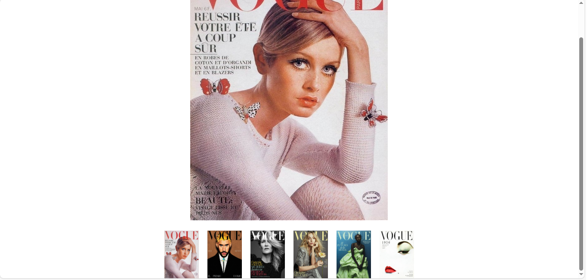
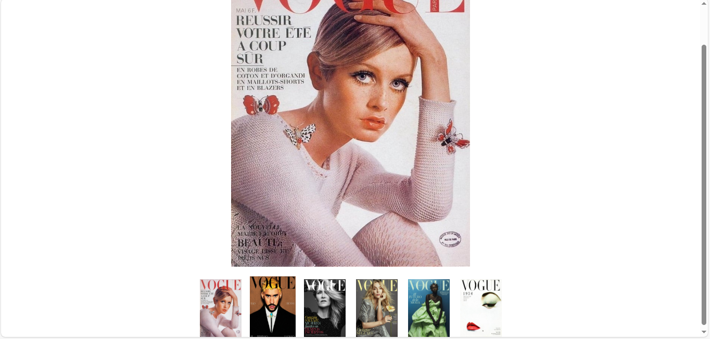
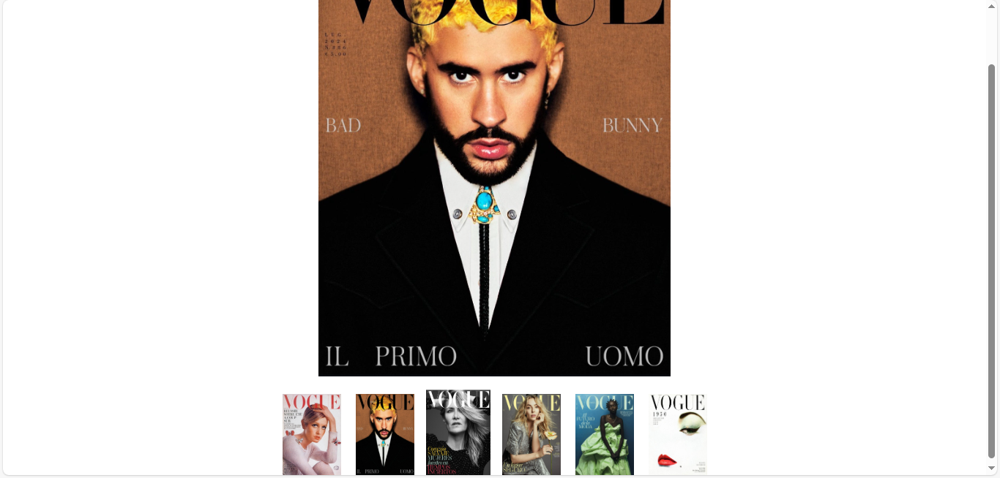

# 📸 Visor de Imágenes de Portadas de Vogue

Este es un **visor de imágenes interactivo** que muestra una imagen en grande seleccionada de entre varias miniaturas de portadas de la revista *Vogue*. Al pasar el ratón por encima de las miniaturas, estas se agrandan ligeramente, y al hacer clic en una de ellas, la imagen grande se cambia a la portada seleccionada.

## 👀 Vista Previa





## 🛠️ Características

- **Interactividad**: Al pasar el ratón por encima de las miniaturas, estas se agrandan un poco. 🖱️✨
- **Cambio de imagen**: Al hacer clic en una miniatura, la imagen principal cambia por la portada seleccionada. 🔄🖼️
- **Diseño sencillo**: Utiliza HTML, CSS y JavaScript para una implementación ligera y fácil de entender. 💻📱

## 💻 Tecnologías Usadas

- **HTML**: Estructura de la página. 🌐
- **CSS**: Estilos y efectos de transición. 🎨
- **JavaScript**: Lógica para cambiar la imagen grande y efectos interactivos. ⚙️

## 📥 Instalación

Para usar este proyecto en tu máquina local, solo necesitas clonar este repositorio y abrir el archivo `index.html` en tu navegador. Aquí te explico los pasos:

1. Clona el repositorio:
      ```bash
   git clone https://github.com/tu_usuario/visor-imagenes-vogue.git
      
3. Abre el archivo index.html en tu navegador.

## 🖥️ Uso

1. Abre el archivo index.html en tu navegador. 🌍
2. Navega por las miniaturas de las portadas de Vogue. 🖼️
3. Pasa el ratón por encima de las miniaturas para ver el efecto de agrandado. 🐭✨
4. Haz clic en cualquier miniatura para que se muestre la portada seleccionada en la imagen grande. 📸

## 🗂️ Estructura de Archivos

El proyecto tiene la siguiente estructura:

```plaintext
VisorDeImagenes/
├── arbolDeNodosIv.html       # Estructura HTML
├── arbolDeNodosIv.css        # Estilos CSS
├── Virsor1.png               # Pantallazo
├── Visor2.png                # Pantallazo
├── Visor3.png                # Pantallazo
└── arbolDeNodosIv.js         # Código JavaScript   
